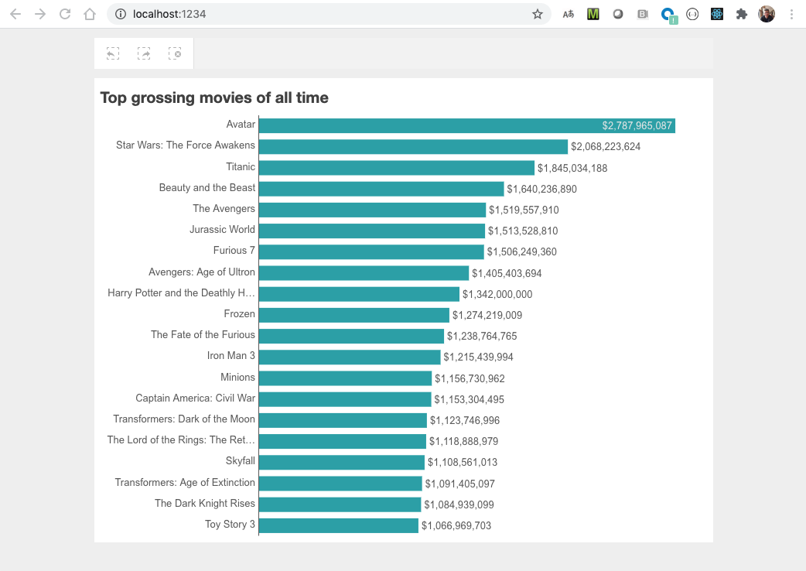

# basic-qlik-mashup

Wraps the Qlik mashup tutorial at https://qlik.dev/tutorials/build-a-simple-mashup-using-nebulajs in a docker container to simplify deployment.

## setup
Setup your tenant using the instructions from the tutorial above, setup a web integration, upload an app and determine the required parameters:
- tenant url
- web integration id
- app id
- chart id

## build and run
Download repo and update docker-compose.yaml to set the parametners above (as environment variables):
```
    environment:
      - MASHUP_URL=https://--insert here--.us.qlikcloud.com
      - MASHUP_WEBINTID=-- insert here -- 
      - MASHUP_APPID=-- insert here --
      - MASHUP_ID=-- insert here --
```

Build and run the docker container:
```
docker build --tag basic-qlik-mashup-image .
docker-compose up -d
```

Open http://localhost:1234 in a browser should show a chart, e.g.:

<p  align="center">
    
</p>


## cleanup
```
docker-compose down
docker rmi basic-qlik-mashup-image
```

## dev setup
Download repo and run:
```
npm install
```

## run dev setup
Set the parameters above as environment variables and then run the app:
```
export MASHUP_URL=https://-- insert here --.us.qlikcloud.com
export MASHUP_WEBINTID=-- insert here -- 
export MASHUP_APPID=-- insert here --
export MASHUP_ID=-- insert here --

npm run start
```

